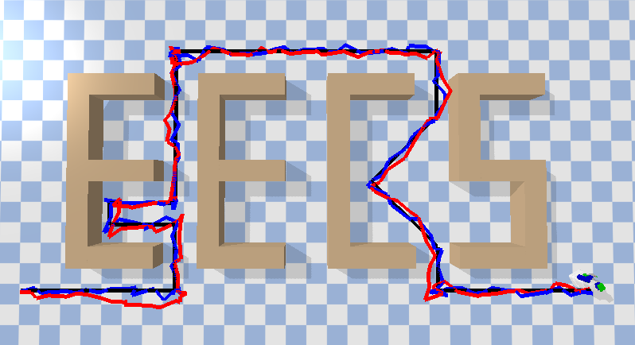

# EECS 498: Introduction to Algorithmic Robotics - Localization project
The project implements a kalman filter and a particle filter and compares their accuracy using pybullet as simulation environment.



# Contributors
+ Che Chen(cctom@umich.edu)
+ Hanxi Wan(wanhanxi@umich.edu)
# Usage

```shell
pip install -r requirements.txt
python demo.py
```
